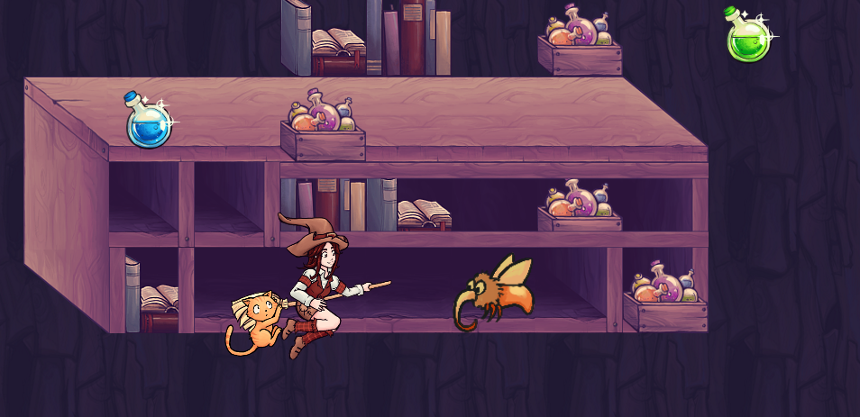

Pepper&Carrot endless runner game
==========================================

Description
------------
[Pepper&Carrot](http://www.peppercarrot.com/) endless runner game **under construction**.

Used Libraries
------------
- libGDX:  https://libgdx.badlogicgames.com/
- nGame:  https://github.com/n0iz/ngame

License and credits
-------------------

- The source code of this game is licensed under the [GNU GPLv3](http://www.gnu.org/licenses/gpl-3.0.html)
- 2D game art assets by Anna Dorokhova are licensed under [CC-BY 4.0](https://creativecommons.org/licenses/by/4.0/)
- This project use the universe of the webcomic [Pepper&Carrot](http://www.peppercarrot.com) created by David Revoy and licensed under [CC-BY 4.0](https://creativecommons.org/licenses/by/4.0/)
